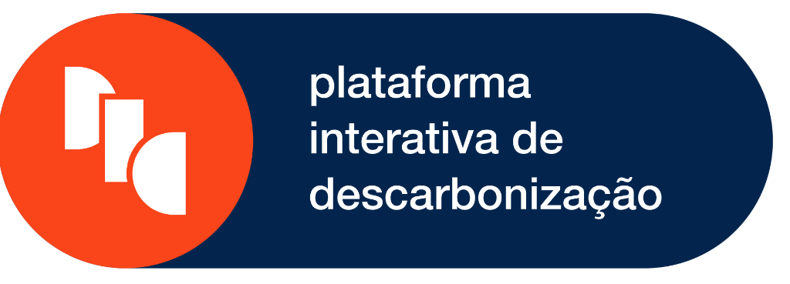



  

# 🚀 PID · Nexus — Inteligência Territorial para a Transição Energética

> **Solução estratégica desenvolvida para o Hackathon E+**
> Uma plataforma unificada para centralizar dados, acervos e análises estratégicas de descarbonização na América Latina.

---

## 🔗 Links Úteis
- **🌐 Site Oficial (Live):** [https://nexus-alpha-liard-60.vercel.app](https://nexus-alpha-liard-60.vercel.app)
- **🎥 Pitch de Apresentação:** [Link do Vídeo/Pitch]
- **📄 Documentação Completa:** [Visualizar Documentação](./3-Documentacao/RESPOSTAS.md)

---

## 🛠️ Estrutura da Entrega

A organização deste repositório segue rigorosamente os critérios do Hackathon:

*   📂 **[1-Codigo-Fonte](./1-Codigo-Fonte):** App Next.js 15, TypeScript e Tailwind CSS.
*   📂 **[2-Design](./2-Design):** Identidade visual, logos, fluxograma e wireframes.
*   📂 **[3-Documentacao](./3-Documentacao):** Estudo de viabilidade, diferenciais e impacto social.
*   📂 **[4-Detalhes-Tecnicos](./4-Detalhes-Tecnicos):** Especificações da stack e manual do usuário.

---

## 📸 Screenshots da Plataforma

<table style="width: 100%">
  <tr>
    <td style="width: 50%">
      
      
<i>Mapa de Ativos Energéticos</i>

    </td>
    <td style="width: 50%">
      
      
<i>Busca Semântica Nexus Search</i>

    </td>
  </tr>
</table>

  
   
  <i>Nexus Copilot - Assistente de IA para Transição Energética</i>

---

## ⚙️ Tecnologias Utilizadas

- **Frontend:** Next.js 15 (React 19), TypeScript, Tailwind CSS.
- **Geospatial:** Leaflet.js, ESRI & CartoDB TileLayers.
- **UI Components:** Lucide Icons, shadcn/ui.
- **Deploy:** Vercel (Edge Runtime).

---

### 👨‍💻 Time PID · Nexus
- **Equipe:** [Seu Nome / Equipe]
- **Evento:** Hackathon E+

---

  Desenvolvido com ❤️ para um futuro mais sustentável.

